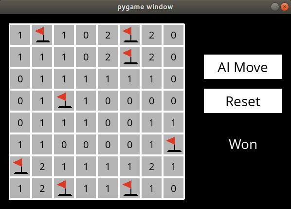

# MinesweeperAI

## Background

Minesweeper is a puzzle game that consists of a grid of cells, where some of the cells contain hidden “mines.” Clicking on a cell that contains a mine detonates the mine, and causes the user to lose the game. Clicking on a “safe” cell (i.e., a cell that does not contain a mine) reveals a number that indicates how many neighboring cells – where a neighbor is a cell that is one square to the left, right, up, down, or diagonal from the given cell – contain a mine.

The goal of the game is to flag (i.e., identify) each of the mines. In many implementations of the game, including this one, the player can flag a mine by right-clicking on a cell (or two-finger clicking, depending on the computer).

## Screenshots



## Running

* Once you have cloned the repository, run the following command to install the required Python package (pygame) for this project if you don’t already have it      installed and then you should be able to run ```python3 runner.py``` to play Minesweeper (or let your AI play for you)!
  ```bash
  $ pip3 install -r requirements.txt

  ```
* When you run your AI (as by clicking “AI Move”), note that it will not always win! There will be some cases where the AI must guess, because it lacks sufficient  information to make a safe move. This is to be expected. runner.py will print whether the AI is making a move it believes to be safe or whether it is making a random move.

---

Made with ❤️ by Ashwin Mittal
